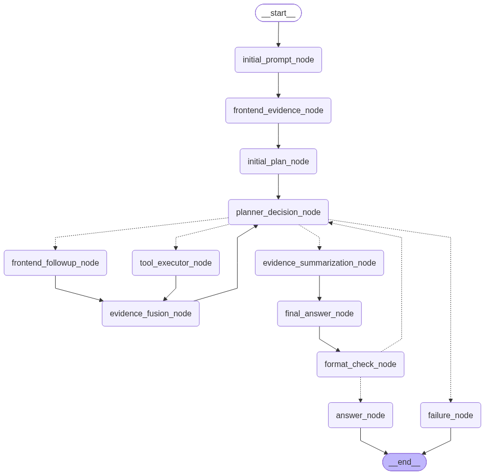
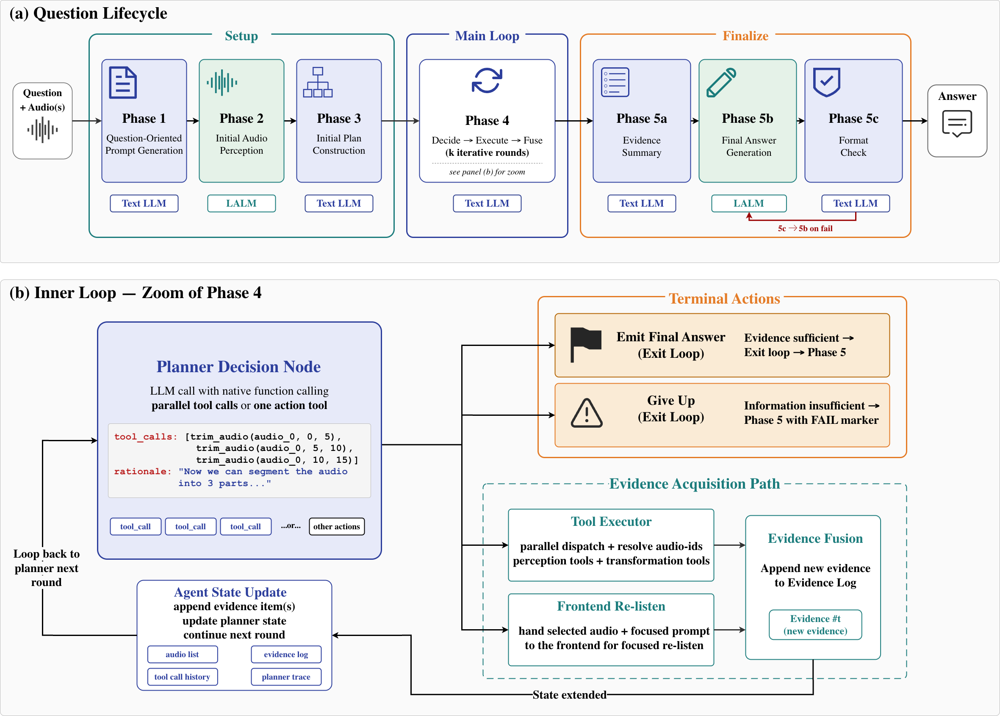
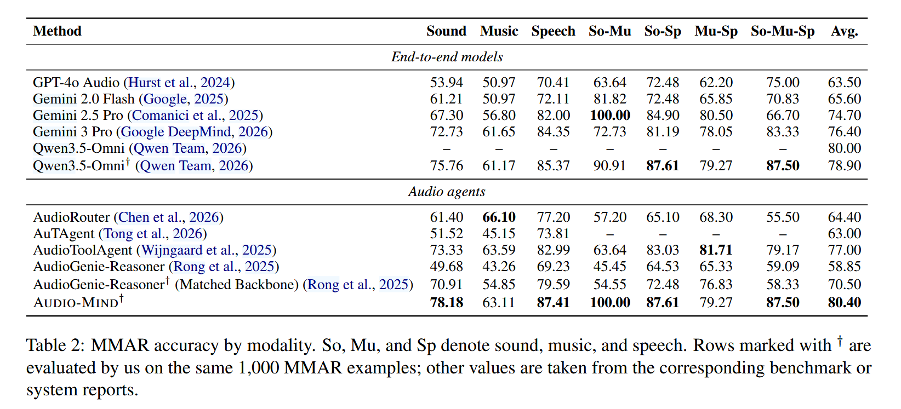
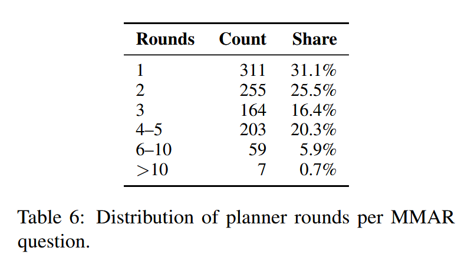
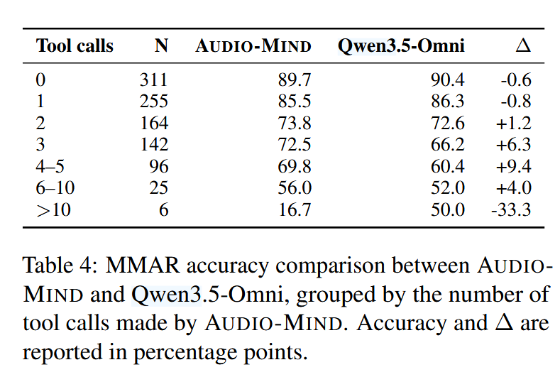
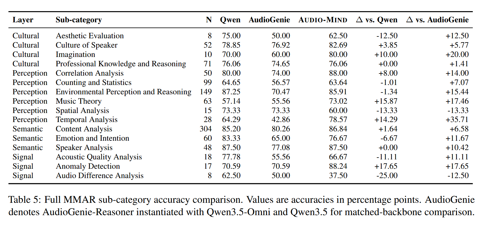
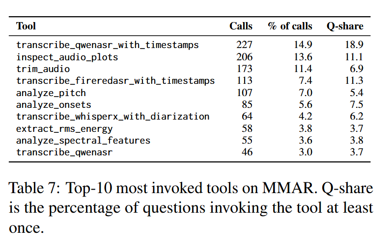
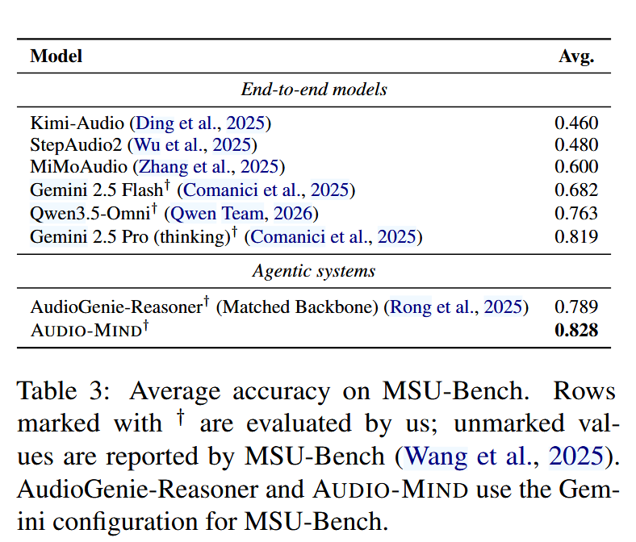

[TOC]

Audio Mind 是一个 audio understanding 领域的可审计、可插拔的agentic framework.

## 一、Audio Mind 的设计

如下图所示，该图是`langraph`自己自带的可视化工具产出的audio mind的数据流节点图：

和论文里的图一致：

总的来说，Audio Mind是这样设计：

1.先把音频和问题给到text llm，并设计精良的提示词工程，让text llm产生比较精良的QoP（Question-Oriented Prompt）,本质是对原问题进行精良加工。

2.把加工后的QoP给到LALM，让frontend先回答初始的音频感知信息。

3.再把初始问题，初始frontend感知信息，以及设计好的精良提示词喂给text llm，让text llm产出一份初始的决策计划，包含可能依赖的工具能力、决策的依赖顺序参考等。

4.拿到初始计划后，text llm再根据设计精良的提示词工程，以及toolspec等信息，进行回答问题/承认失败/前端重感知/选择并执行工具的循环。

5.如果选择前端重感知和执行工具，则都会产生新的evidence,把新的evidence融合到共享状态，供下次循环做决策使用。注意是evidence而不是最终结果，模型被告知evidence以及评估这条evidence的置信度水平，来综合考虑是否有把握回答问题。

6.如果选择回答问题，那么首先text llm会使用设计好的精良的提示词工程，以及evidence列表信息先总结，提取出一版总结摘要，过滤掉无用的思考决策过程、无用信息等信息。然后再把初始问题，提取出的总结摘要配合精良的提示词工程一同喂给frontend，产生final answer，最后text llm进行格式检查，无误则本task完成，有误则把错误信息当成evidence append到共享状态，重新进入decision loop。

7.如果选择承认失败则终止。一般是满足了max_steps到达上限等终止条件。

## 二、实验设计和结果

### 2.1 MMAR

#### 2.1.1 setup

- Frontend : `qwen-3.5-omni`
- Text LLM : `qwen3.5`

#### 2.1.2 results

#### 2.1.3 为什么之前的优秀系统(比如AudioGenie-Reasoner)跑分还不如单独的frontend?

AudioGenie-Reasoner 在 2025 年是对的，那时候基座只有 7B，工具虽然有偏见，但比"听不懂"强。它的论文价值在于"如何把弱基座的能力榨干"。但到了 2026 年，基座变成了 Qwen3.5-Omni 这种级别的模型，同样的流水线设计反而成了枷锁——它把强基座当成弱基座用，硬生生把 78 分的水平压到了 70 分。AUDIO-MIND 的核心贡献就是指出：强基座时代，agentic 设计要从"给弱基座补短板"转向"别挡着强基座发挥"。

#### 2.1.4 工具调用的行为分析

目的：验证tool use是否真的按照条件证据收集的角色作用。MMAR一共1k个task,其中一个由于护栏走入了承认失败分支，所以取999个样本的轨迹分析，每个问题平均1.68次tool call，31.2%的问题没有调用任何工具，所以这个框架确实是**条件性**地证据收集。当前端证据看起来不够时，工具调用深度增加；当前端证据看起来够时，工具调用保持低水平。这正是 AUDIO-MIND 设计的理想行为：

简单问题 → 前端自己搞定，不折腾工具 ✅

中难问题 → 精准补几个工具，显著提升准确率 ✅

极难问题 → 工具也救不了，但至少系统尝试过（虽然这里可能过度调用了）

这张表证明了 AUDIO-MIND 的"条件性"不是纸上谈兵：规划器真能感知到前端哪里不懂，并据此决定调多少工具。工具调用越多的题，本质上越难；工具在"该用的时候"确实有用，在这些难题上，AUDIO-MIND 比强基座直接推理的优势最大（高出近10分）。只有极少数极端难题（0.6%）会出现过度调用，这说明规划器的"止损机制"还有改进空间，当工具调用超过一定次数还没补上缺口时，应该直接放弃或输出"无法确定"，而不是继续调。可能的解释是多个工具结果证据让前端分心了。

#### 2.1.5 MMAR-Rubrics的跑分

AUDIO-MIND ：66.5%
only frontend Qwen3.5-Omni ：59.6%

#### 2.1.6 在具体子分类的跑分

tool能提供帮助的特定领域跑分增加多，而主要依靠frontend本身的则少甚至倒退。

#### 2.1.7 每个工具的调用频率分析（重尾）

虽然是重尾分布，但是每个工具都至少被调用过一次，证明了工具列表不是冗余的能力堆积。

#### 2.1.8 re-listening次数分析

re-listening 50/999，for 64 re-listens in total.这和re-listening的角色是一致的，不是通用的fallback,而是真的一种条件性的获取证据的方式。

#### 2.1.9 综合结论

- Audio Mind是新SOTA，在MMAR的string_match和MMAR-Rubrics上都是如此
- 强基座时代，agentic 设计要从"给弱基座补短板"转向"别挡着强基座发挥"。
- Audio Mind确实是条件性地证据收集。
- Audio Mind性能的提升依赖任务的特定性：tool能提供帮助的特定领域跑分增加多，而主要依靠frontend本身的则少甚至倒退。
- 每个工具的调用频率分布是重尾的，但是每个工具都至少被调用过一次，证明了工具列表不是冗余的能力堆积。

### 2.2 MSU Bench

#### 2.2.1 setup

- Frontend : `gemini-2.5-pro`
- Text LLM : `gemini-3.0-flash`

#### 2.2.2 results

#### 2.2.3 结论

- Audio Mind在MSU Bench上是新SOTA

## 三、工程阅读和复现情况

我已经熟悉了这个工程的数据流流向，对关键逻辑精读了代码。我在windows wsl2 ubuntu 26.04+rtx 5080 laptop上跑通了audio mind。我拉取了我对官方仓库的fork：https://github.com/ZHYsfl/Audio-Mind，完全配置好了Audio Mind所需的环境，并且稍微改动以支持blackwell。小量复现用的是阿里云百炼的API（frontend `qwen3.5-omni-plus`，planner `qwen3.5-plus`），与论文的Gemini系配置不同，跑分仅作参考。

我在MMAR上小量跑了10个task，跑分如下：

| 评测方式 | 跑分 |
|---|---|
| string match | **80%**（8/10） |
| MMAR-Rubrics（LLM as judge） | accuracy **80%** / mean score **70.0/100** |

Rubrics 的口径说明（官方脚本 `evaluation_rubrics.py`，两个数以全部 10 个样本为分母）：
- **accuracy 80%**：官方规定 judge 只在 string match 通过的样本上打分，没过线的直接判 0 分、不进 judge；`correct` 只表示"进了 judge 并被有效评分"。因此它等于 string match 过线率（8/10）。
- **mean score 70.0/100**：judge 按题目自带的 rubric 逐条打分（归一化到 0~1），5 个 rater（NUM_RATERS=5）各评一次、去掉最高最低取中间 3 个的平均；10 个样本的平均分 ×100 就是 70.0（含 2 个 0 分样本；8 个有效样本的平均分为 87.5）。论文正文的 66.5% 就是这个"含 0 分"的全体平均口径。

补充：第一轮不注入选项时string match只有10%。MMAR官方的string match是字面token匹配而非语义匹配，frontend听懂了也会因为措辞不同（如把"Merry Christmas"意译成中文）得0分。第二轮把4个选项注入prompt并要求"字母+原文"作答后到了80%，与论文口径一致（论文的80.4%同样是注入选项的）。

我在MSU Bench上小量跑了10个task，跑分如下：

| 指标 | 跑分 |
|---|---|
| exact-match accuracy | **100%**（10/10） |

10个样本覆盖8种scenario、9种question_type、tier1/2。工程点：（1）全音频统一转16k mono——MSU原始音频长达310s（79MB），base64直传被API拒，16k后9.9MB即可通过；（2）锚点导向题型（no_index/time_index/transcript_index等）按speaker_meta锚点seg裁剪成21~40s窗口再喂，整段型题型（speaker counting/reverse等）保留全音频；（3）裁剪带来的时间轴偏移问题：planner调trim_audio时仍旧用原录音绝对时间（如192.73s），对裁剪后的音频会trim出空文件、工具空转，已在prompt中追加时间偏移说明（in effect:补测到10/10）。第一个样本首轮API 400失败（110s音频base64直传被拒），重试后答对（C），最终10/10。

## 四、总结

Audio Mind 是一个 audio understanding 领域的可审计、可插拔的agentic framework.我完成了对其工程项目的核心数据流的熟悉、关键逻辑的精读，并配置好环境小量跑了MMAU和MSU Bench的各自10个task的评测。Audio Mind本身通过一系列实验证明了以下等结论：

- Audio Mind是新SOTA，在MMAR的string_match、MMAR-Rubrics和MSU Bench上都是如此
- 当frontend(LALM)变得越来越强的今天，工具已经不能被看成自动提升性能的模块，什么时候正确调用工具、如何正确对待工具调用的输出（不一定客观）才有助于性能提升成为新的瓶颈和问题。强基座时代，agentic 设计要从"给弱基座补短板"转向"别挡着强基座发挥"。
- Audio Mind确实是条件性地证据收集。
- Audio Mind性能的提升依赖任务的特定性：tool能提供帮助的特定领域跑分增加多，而主要依靠frontend本身的则少甚至倒退。
- 每个工具的调用频率分布是重尾的，但是每个工具都至少被调用过一次，证明了工具列表不是冗余的能力堆积。