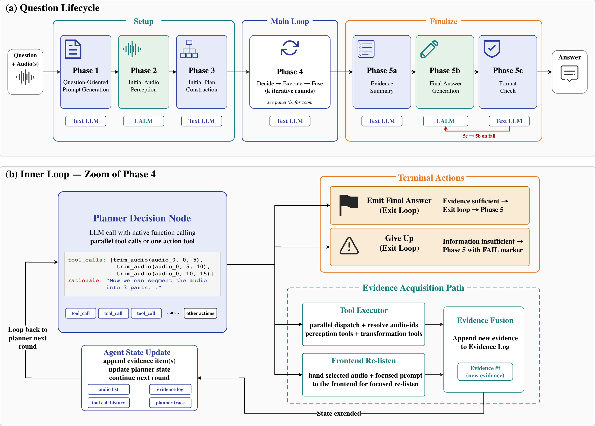

# Audio-Mind

This repository is the official implementation of **[Audio-Mind: An Auditable Agentic Framework for Audio Understanding](https://arxiv.org/pdf/2605.28480)** — an agentic framework that answers questions about audio by having a text-LLM planner iteratively orchestrate a large audio-language model (LALM) and specialized audio tools, building an auditable evidence trail before producing a final, format-checked answer.



## How it works

Each question flows through three stages (see figure):

- **Setup** — generate a question-oriented prompt, run initial audio perception with the LALM, and build an initial plan.
- **Main loop** — the planner iteratively *decides → executes → fuses*: it dispatches audio tools (ASR, diarization, chord/tempo, trimming, …) and/or re-queries the LALM, appending each result to a growing evidence log, until the evidence is sufficient (or it gives up).
- **Finalize** — summarize the evidence, let the LALM generate the answer from the original audio plus the summary, and run a format check before returning.

Every prompt, decision, tool call, and piece of evidence is recorded, so each answer is fully auditable.

## Installation

The full bootstrap (prerequisites, environment, per-tool environments, model downloads, verification) lives in **[ENVIRONMENT_SETUP.md](./ENVIRONMENT_SETUP.md)** — follow it end to end on a fresh clone.

Quickstart (assumes `uv` and a DashScope API key are available):

```bash
uv venv --python 3.11 .venv && source .venv/bin/activate
uv pip install -e '.[api,dev,download]'
export AUDIO_AGENT_MODELS_DIR="$PWD/models"
./setup_all_tools.sh                 # build the MCP tool environments
audio-agent-download-models --all
./verify_all_tools.sh                # sanity check
```

## Usage

The API path needs no local GPU for the planner/LALM — only the MCP tools that load their own local models do.

```bash
export DASHSCOPE_API_KEY="sk-..."
export AUDIO_AGENT_MODELS_DIR="$PWD/models"
python -m audio_agent.examples.demo_run \
  --audio /path/to/audio.wav \
  --question "What is being said in this audio?"
```

Pass several files for multi-audio tasks such as speaker verification: `--audio first.wav second.wav`.

## Extending the framework

**Add a new tool.** Tools are MCP servers under `audio_agent/tools/catalog/<tool>/`. The recommended path is the **Harness-First Agent Workflow** in [`tool_preparation/`](./tool_preparation/README.md): point an agent at that guide with a `TOOL_INPUT` spec, and it selects a backend, builds an isolated environment, validates import/load/infer/contract, and generates the wrapper. For manual setup, copy `audio_agent/tools/catalog/_template/` and adapt `server.py` / `config.yaml` / `setup.sh`.

**Add a frontend (LALM).** For any OpenAI-compatible audio API, use the built-in `OpenAICompatibleFrontend`:

```python
from audio_agent.frontend.openai_compatible_frontend import OpenAICompatibleFrontend

frontend = OpenAICompatibleFrontend(
    model="qwen3.5-omni-plus",
    api_key="sk-...",                                  # or set DASHSCOPE_API_KEY
    base_url="https://dashscope.aliyuncs.com/compatible-mode/v1",
)
```

For a local or custom model, subclass `BaseModelFrontend` (`audio_agent/frontend/model_frontend.py`) and implement its abstract hooks (model init + `call_model`); `Qwen25OmniFrontend` is a worked local-model example.

**Add a planner (text LLM).** For any OpenAI-compatible chat model with function calling, use `OpenAICompatiblePlanner`:

```python
from audio_agent.planner.openai_compatible_planner import OpenAICompatiblePlanner

planner = OpenAICompatiblePlanner(
    model="qwen3.5-plus",
    api_key="sk-...",
    base_url="https://dashscope.aliyuncs.com/compatible-mode/v1",
)
```

For a custom backend, subclass `BaseModelPlanner` (`audio_agent/planner/model_planner.py`); native function calling is required for the tool loop.

## License

MIT — see [LICENSE](./LICENSE). The framework itself is MIT, but several catalog tools load third-party model weights under their own licenses (some non-commercial or gated) — e.g. `diarizen` uses `BUT-FIT/diarizen-wavlm-large-s80-md` (CC BY-NC 4.0), and the `pyannote` diarization models are gated on HuggingFace. Verify license compatibility for your use before deploying.

## Citation

If you use Audio-Mind in your research, please cite:

```bibtex
@article{wang2026audiomind,
  title   = {Audio-Mind: An Auditable Agentic Framework for Audio Understanding},
  author  = {Wang, Yucheng* and Peng, Jing* and Li, Hanqi and Wang, Chenghao and Tu, Wenming and Xi, Yu and Sun, Zhaokai and Yu, Kai and Wang, Shuai},
  journal = {arXiv preprint arXiv:2605.28480},
  year    = {2026},
  url     = {https://arxiv.org/abs/2605.28480}
}
```